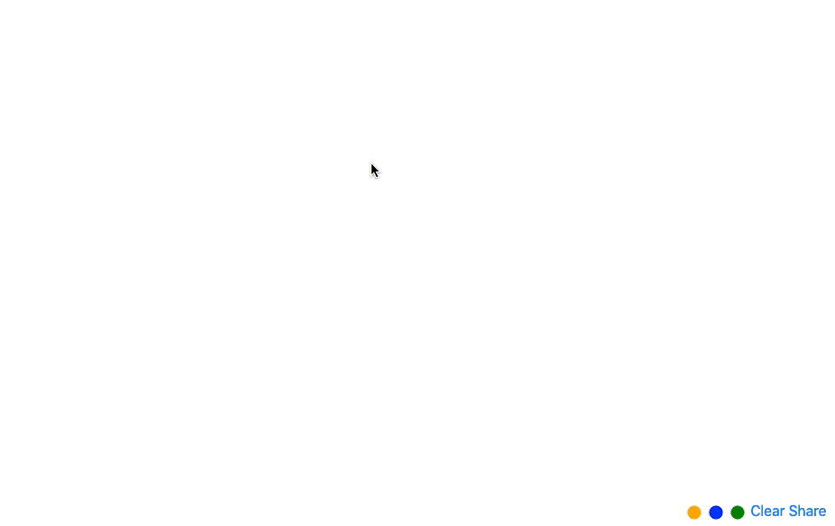

# Paint-o-Brain

Draw your brain source code for website.




### Build

It should be sufficient to clone this repository and to start a web-server supporting php. For example:

```
brew install php
git clone https://github.com/mmiv-center/paintobrain.git
cd paintobrain
php -S localhost:3000
```

And open a web-browser on "localhost:3000".
